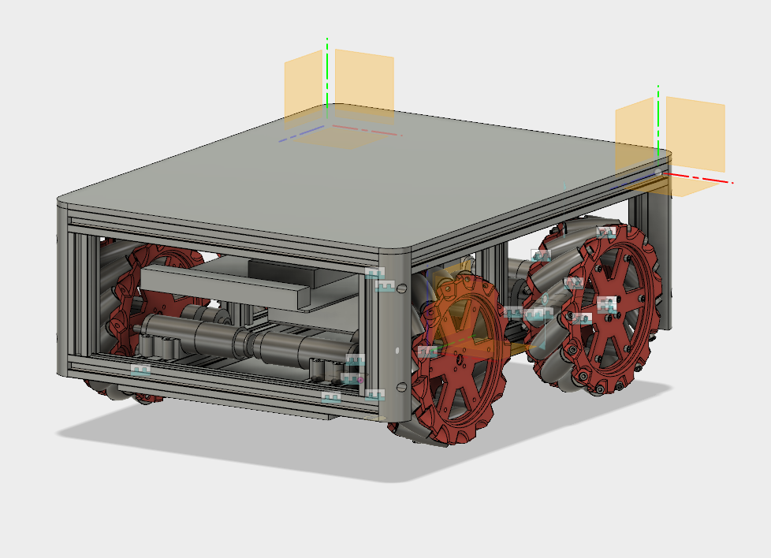

Kinisi - In progress
============
### Overview
Kinisi robotics platform is a mecanim wheels multipurpose platform. That can be used for variety of projects like telepresence robot or indoor goods transportations robots.



### Build
The project has a shell script that pulls all thirdparty dependencies and installs them.
Follow instructions below to pull dependencies and build the project.
```
apt-get update
apt-get upgrade

sudo ./getthirdparty.sh
mkdir ./build
cd ./build
cmake .
cmake --build .
```

### Configure
In order to configure the platform, you need to create settings.json file and place it next to the executable. Here is an example of settings.json file:
```
{
    "connection":{
        "protocol": "tcp",
        "host": "localhost",
        "port": 8883,
        "username" : "empty",
        "password" : ""
    }
}
```

### Kinisi Wheels
Kinisi mecanum wheels was built as a part of Kinisi robotics platform project. You can find Kinisi wheels on GitHub or Thingiverse.
https://github.com/vsreality/KinisiWheels
https://www.thingiverse.com/thing:2974969
